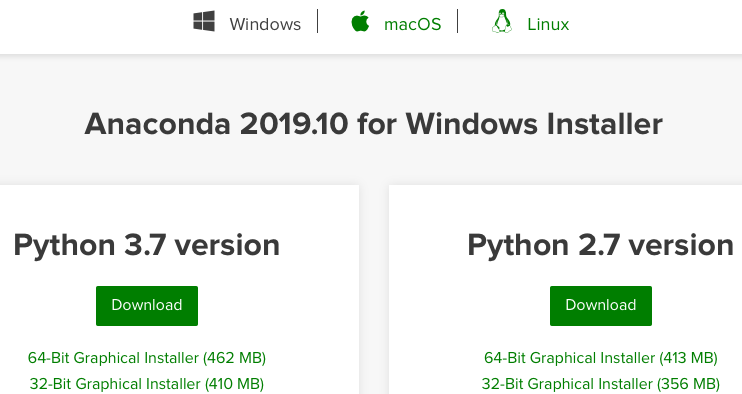
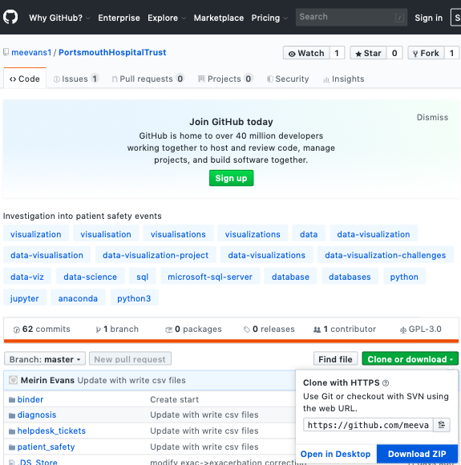

# PortsmouthHospitalTrust

The main example of NLP is in diagnosis/bedview_diagnosis.ipynb

Investigation into medicine patient safety events: patient_safety/

Investigation into diagnoses: diagnosis/

Investigation into helpdesk tickets: helpdesk_tickets/

## Update results with new events

To update with new results you need access to the L_AAGDATIX SQL server at PHT with ApplicationIntent=ReadOnly;

1. Download 32-bit Python 3.7 Anaconda from https://www.anaconda.com/distribution/ (you'll need permission to get this on a RICH client).

2. Once installed, click on the Windows character, search for "jupyter" and click on "Jupyter notebook (Anaconda3)".

3. On this webpage, click on the  green "Clone or download" text button, then the  blue "Download ZIP" text button (you'll need permission on a RICH client).

4. Once the ZIP has been downloaded, unzip it and move the folder to C://Users/your_username

5. Open the webpage where Jupyter should've opened (e.g. Chrome).

6. Click on the .ipynb file you want to update, e.g. patient_safety/ --> patient_medicine_events_over_time/ --> hour_of_patient_medicine_safety_events_at_QA.ipynb

7. Click _Cell_ --> _Run All_ to update results with the latest medicine patients safety events at QA.

8. The easiest option is to take screenshots of your new results to show off to your friends!
